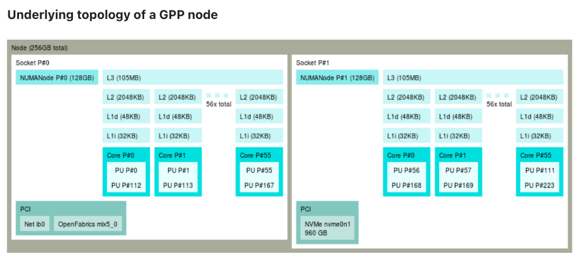
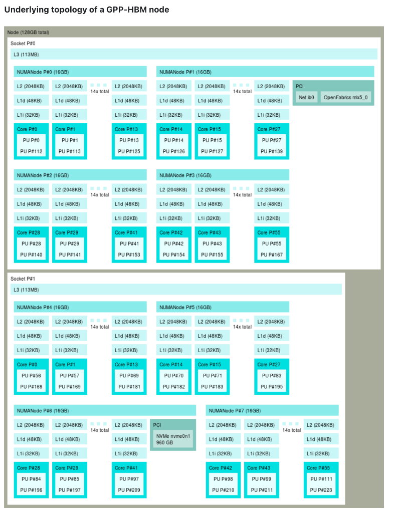
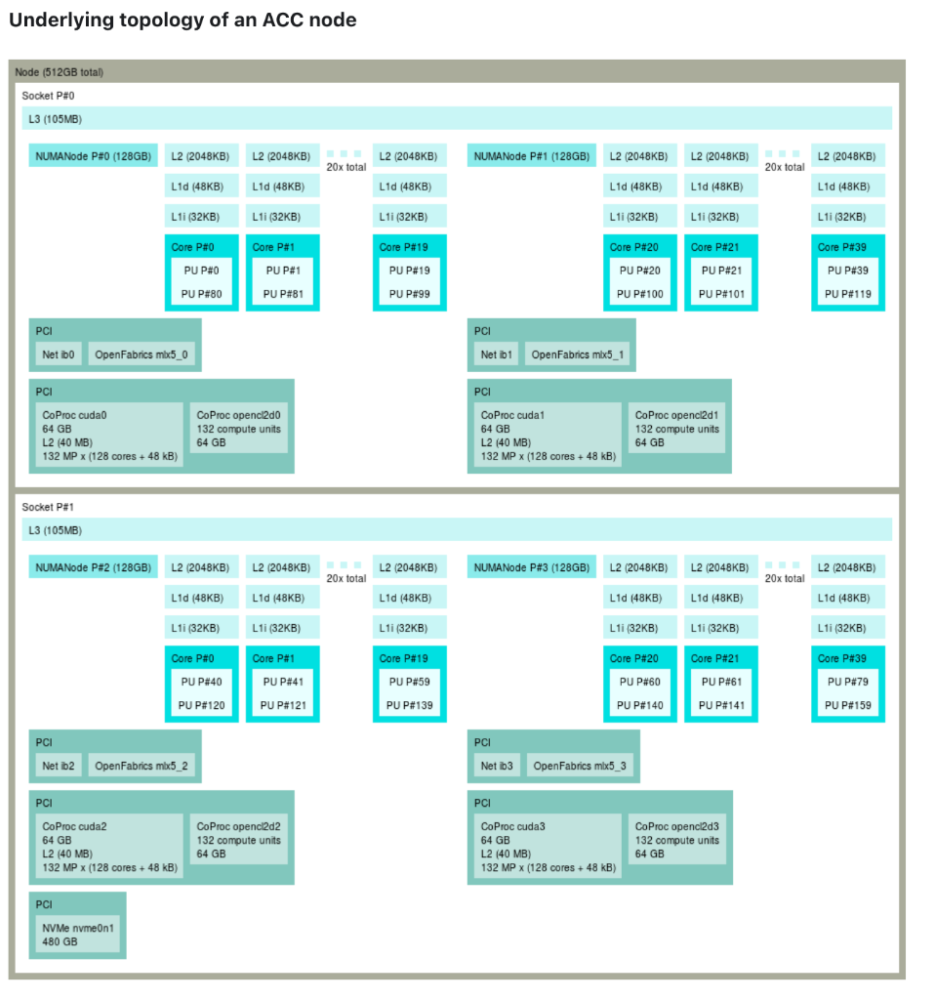

# 04. Running Jobs (Deep Dive)

## 1. Partitions & QoS
You will almost always use `partition=acc` (Accelerated).

### Partitions
*   `acc`: H100 GPU Nodes.
*   `gpp`: CPU only.

## 2. Partition Architecture (Topology)

Understanding the hardware topology is vital for performance.

### General Purpose (GPP) Node

*   **Sockets**: 2x Intel Sapphire Rapids (56 cores each = 112 cores/node).
*   **NUMA**: Each socket is split into sub-NUMA clusters.
*   **RAM**: 256GB total standard.

### General Purpose HBM (GPP-HBM) Node

*   **Specialty**: High Bandwidth Memory nodes.
*   **Sockets**: 2x Intel Sapphire Rapids with HBM.
*   **Use Case**: Memory-bound CPU simulations (CFD, Weather) that don't use GPUs.


### Accelerated (ACC) Node

*   **GPU**: 4x NVIDIA H100 (64GB HBM3 each).
*   **CPU**: 4th Gen Intel Xeon (112 cores).
*   **IO**: NVMe storage (480GB) available for fast local scratch.

> [!IMPORTANT]
> **CPU Affinity**: Notice the NUMA domains in the images above? If you run a job without binding (`--cpu-bind`), your process might jump between sockets, killing performance. **Always** use `export SRUN_CPUS_PER_TASK`.

## 3. Submitting Jobs (Quality of Service)
*   `acc_debug`:
    *   Time limit: 2 hours.
    *   Limit: 1 job.
    *   **Priority**: Boosted. Use this to check if your code runs.
*   `acc_normal`:
    *   Time limit: 48 hours.
    *   **Use for**: Production training.

## 4. Expert Job Management

### Interactive Debugging (`salloc`)
Don't wait in the queue just to find a syntax error.
```bash
# "Give me a shell on a GPU node for 30 mins"
salloc --account=bscXX --qos=acc_debug --partition=acc --gres=gpu:1 --cpus-per-task=20 --time=00:30:00
```
*   Use `srun --pty bash` once allocated if the shell doesn't open automatically.

### Batch Script Specifics
The header of your `.sbatch` file controls everything.

```bash
#!/bin/bash
#SBATCH --job-name=llm_train
#SBATCH --output=%x_%j.out   # %x=jobname, %j=jobid
#SBATCH --error=%x_%j.err
#SBATCH --nodes=1
#SBATCH --gres=gpu:4         # Request 4 GPUs
#SBATCH --cpus-per-task=80   # 20 * 4 = 80 CPUs
#SBATCH --exclusive          # Dedicate node to me (good for benchmarks)
```

### Forensic Analysis (`sacct`)
Your job died. Why?
```bash
sacct -j <JOBID> --format=JobID,State,ExitCode,MaxRSS,Elapsed,NodeList
```
*   **MaxRSS**: Maximum Resident Set Size (RAM). If this is close to 2TB (node limit) or your requested limit, you hit OOM.
*   **ExitCode**: `0:0` (Success), `1:0` (Error), `0:125` (OOM/Kill).

### Resource Rules (ACC)
MN5 enforces strict proportionality.
*   **Ratio**: 1 GPU : 20 CPUs.
*   **Violation**: Requesting `gpu:1` and `cpus-per-task:40` will wait forever.
*   **Memory**: RAM is allocated per CPU. approx 2-3GB per CPU.

## 5. Troubleshooting Common Failures
1.  **"Socket verification failed"**: SSH key issue.
2.  **"QOSMaxCpusPerUserLimit"**: You already have max jobs running. Wait.
3.  **"DIB / Data IB Error"**: Infiniband network glitch. Usually transient. Resubmit.
4.  **"Bus Error"**: Often means you accessed a file that doesn't exist or a corrupt memory pointer. Check data paths.
