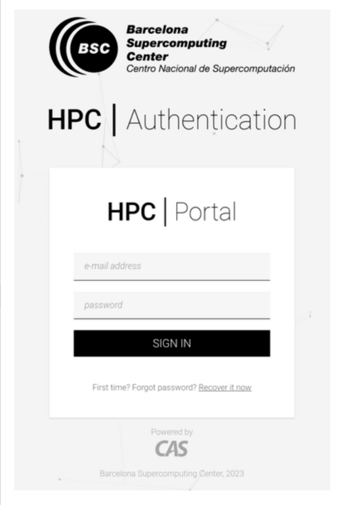
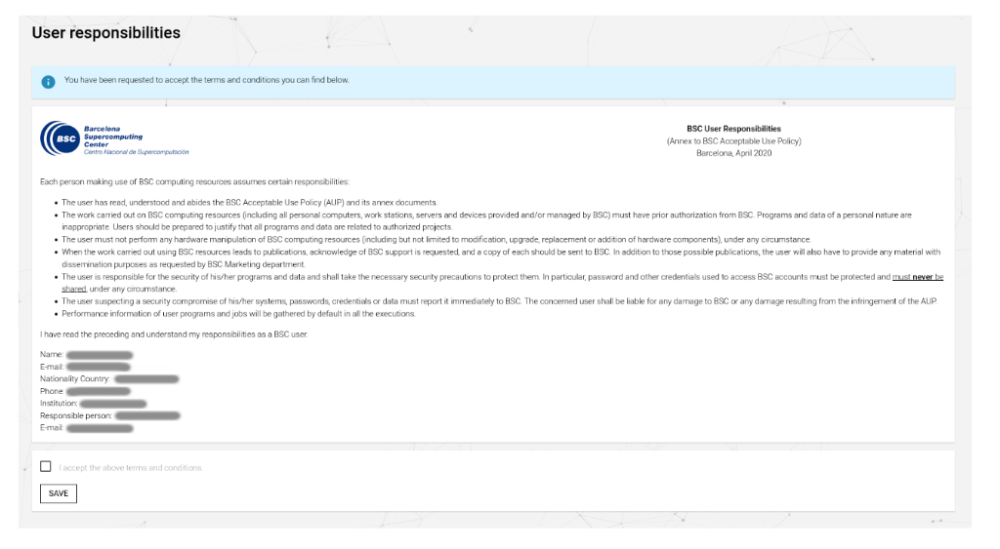

# 08. Policies & User Responsibilities

## 1. User Responsibilities
As a user of a shared supercomputer, you are expected to:
*   **Data Management**: Backup your own critical data. `/gpfs/scratch` is purged. `/gpfs/projects` is backed up but you should have off-site copies of papers/results.
*   **Login Nodes**: **NEVER** run heavy computational scripts on login nodes (`alogin`/`glogin`). They are for editing, compilation, and job submission only. Violators are often auto-killed or banned.
*   **Security**: Accounts are personal and non-transferable. Never share your password or SSH key.

## 2. Password Management
*   **Changing Password**: If you need to change your password, use the official BSC portal (link provided in your welcome email) or check the [HPC User Portal](https://www.bsc.es/supportkc/docs-utilities/hpc_portal).
    
*   **Legal Agreement**: On first login (or annual renewal), you must accept the Acceptable Use Policy (AUP).
    
*   **SSH Keys**: We strongly recommend using SSH keys with passphrases for convenience and security.

## 3. Quotas
You are responsible for monitoring your usage.
*   **Check Quota**: `bsc_quota`
*   **Grace Period**: If you exceed soft limits, you have ~7 days to clean up before you are blocked from writing.

## 4. CPU Affinity & Performance
*   **Binding**: Proper process binding is your responsibility. Using `srun` without correct flags (see `00_new_essential_changes.md`) can cause processes to stack on the same core, destroying performance ($$ lost).
*   **Efficiency**: Aim for >80% GPU utilization. If your job averages 10%, you are wasting resources and blocking others.
