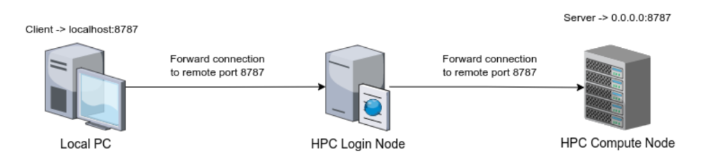
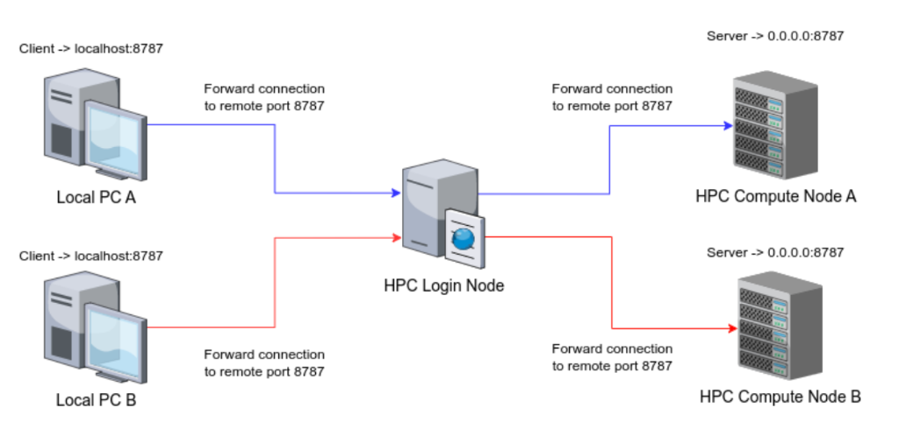
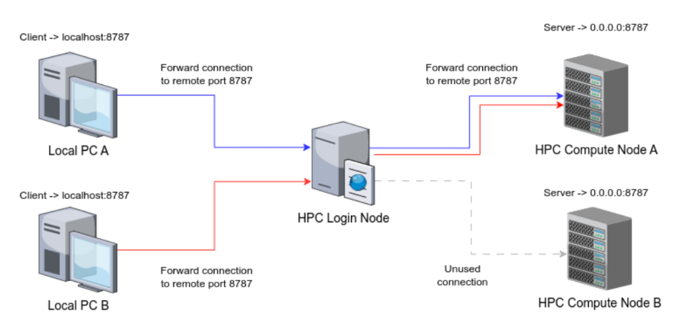
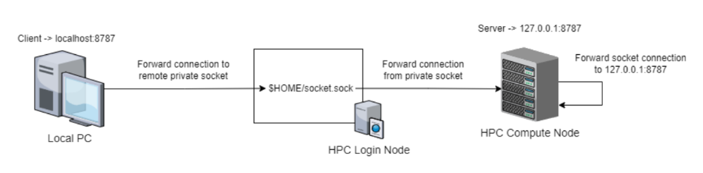
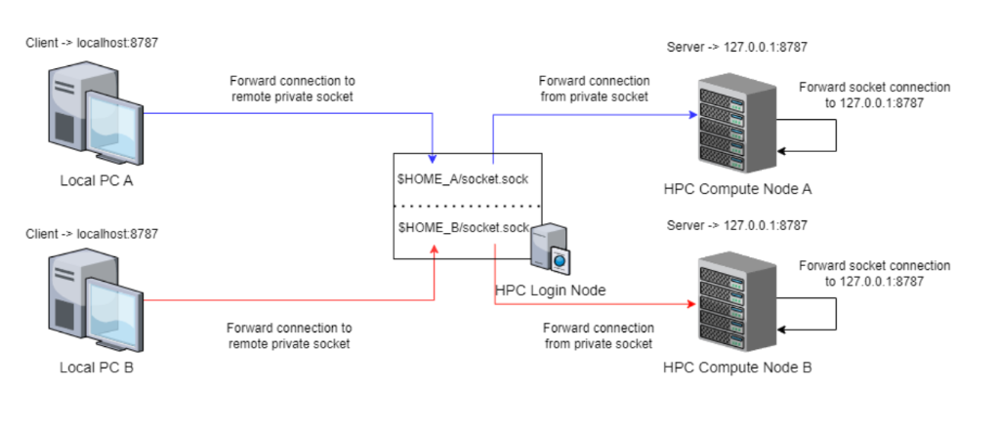

# 09. Advanced Utilities & Remote Connections

## 1. Remote Connections & Port Forwarding
Running a Jupyter Notebook or Tensorboard on a compute node and viewing it on your Mac requires **SSH Tunneling**.

### The Concept
Your laptop cannot "see" the compute node IP directly (it's behind a firewall). You must tunnel through the Login Node.

### Scenario A: Basic TCP Forwarding

You forward a port (e.g., 8888) from the compute node, through the login node, to your localhost.

### Scenario B: Multi-Node Tunneling

If you have jobs running on **different** compute nodes (e.g., Node A and Node B), you can tunnel to both simultaneously using different local ports.
```bash
# Tunnel 8888 -> Node A, 8889 -> Node B
ssh -L 8888:nodeA:8888 -L 8889:nodeB:8888 bscXXYY@alogin1.bsc.es
```

### Scenario C: Multi-Client Forwarding

Two different users (or two laptops) can tunnel to different compute nodes through the same login gateway without conflict.

### Scenario D: Socket Forwarding (Secure & Scalable)

Uses a Unix socket file instead of a TCP port. This is safer as it avoids port collisions.

#### Multi-Socket Setup

Advanced users can map multiple sockets (one per compute job) to different local socket files.


## 2. BSC Specific Commands
*   `bsc_quota`: Check storage limits.
*   `bsc_jobs`: Summarized view of your active jobs.
*   `bsc_load`: Check status of login nodes (load avg).

## 3. Data Transfer Machines (`dtmachines`)
For TB-scale transfers, do not use `glogin` or `alogin`.
*   **Hostname**: `dt01.bsc.es`, `dt02.bsc.es`
*   **Usage**:
    1.  SSH into `dt01`.
    2.  Run `rsync`, `scp`, or `globus`.
    3.  Logout.

## 4. X11 Forwarding (GUI Apps)
If you need to open a GUI window (e.g., a plot):
1.  **Mac**: Install **XQuartz**.
2.  **SSH**: Add `-X` or `-Y` flag.
    ```bash
    ssh -Y bscXXYY@glogin1.bsc.es
    ```
3.  **Test**: Run `xeyes`. If eyes appear on your desktop, it works.

## 5. CPU Affinity (Detailed)
See `04_running_jobs.md` for the topology diagrams.
*   **Why**: MN5 nodes have 2 sockets. Crossing sockets costs ~40% performance penalty.
*   **How**:
    ```bash
    # In SBATCH
    #SBATCH --cpu-bind=verbose,interfaces
    ```
