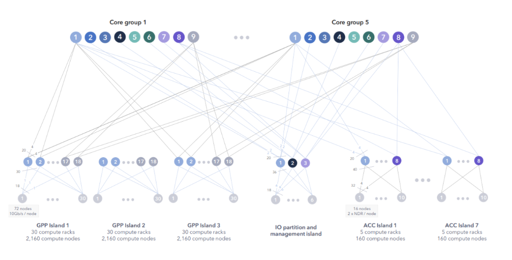

# MareNostrum 5 Guide - Domyn Guard




## Overview
This comprehensive guide consolidates all essential information for using the MareNostrum 5 (MN5) supercomputer, tailored for the Domyn Guard team's LLM training workflows.
 on the BSC supercomputer.

> [!IMPORTANT]
> **No Hallucinations**: Information here is strict adherence to the [BSC Support Knowledge Center](https://www.bsc.es/supportkc/docs/MareNostrum5/intro/).

## 1. System Architecture
MN5 has two distinct partitions. You must know which one you are targeting.

| Feature | **GPP (General Purpose)** | **ACC (Accelerated)** |
| :--- | :--- | :--- |
| **Use Case** | Data prep, CPU inference, compilation | **LLM Training**, GPU inference |
| **CPU** | Intel Sapphire Rapids (112 cores/node) | Intel Sapphire Rapids (80 cores/node) |
| **GPU** | None | **4x NVIDIA H100 (64GB HBM2)** |
| **RAM** | 256 GB - 2 TB | 512 GB |
| **Login Node** | `glogin1.bsc.es` | `alogin1.bsc.es` |

**For Training**: You will exclusively use **ACC**.
**For Preprocessing**: You may use **GPP** to save GPU quotas.

---

## 2. File Systems & Quotas
Do not run jobs from your HOME directory.

| Path | Purpose | Backup? | Quota | Performance |
| :--- | :--- | :--- | :--- | :--- |
| `/gpfs/home` | Source code, scripts, configs. | Yes | Strict | Low (MetaData heavy) |
| `/gpfs/projects` | Shared datasets, final checkpoints. | Daily | Group-based | High |
| `/gpfs/scratch` | Temporary checkpoints, logs, training. | **NO (Purged)** | Group-based | **Highest** |

**Best Practice**:
1. Clone repo in `/gpfs/home`.
2. Move data to `/gpfs/projects` (read-only during training).
3. Output checkpoints/logs to `/gpfs/scratch`.

---

## 3. Environment Setup
MN5 uses specific modules. You should not install system-wide packages.

### Recommended `.bashrc` or Setup Script
```bash
# Clean environment
module purge

# Load basic tools
module load git
module load vim
module load python/3.11  # Check 'module avail python' for exact version

# CUDA for LLM Training
module load cuda/11.8    # Or 12.x depending on your codebase requirements
module load cudnn/8.9.7

# Create Virtual Environment (in project dir)
# python3 -m venv /gpfs/projects/bscXX/domyn-guard/venv
# source /gpfs/projects/bscXX/domyn-guard/venv/bin/activate
```

---

## 4. Running Jobs (ACC Partition)
You interact with the cluster via SLURM.

### Important Constraints
*   **CPU Ratio**: For every 1 GPU, you **MUST** request 20 CPUs.
*   **Memory**: You get proportionate memory.

### Interactive Session (Debug)
To get a shell on a GPU node for testing:
```bash
salloc --partition=acc_debug \
       --gres=gpu:1 \
       --cpus-per-task=20 \
       --time=01:00:00 \
       --qos=acc_debug
```

### Batch Job (Training)
See `scripts/train.sbatch` for a complete template.

---

## 5. Multi-Node distributed Training
MN5 nodes are connected via NDR200 InfiniBand (200Gb/s).
*   **Launcher**: Use `srun` (SLURM native) or `torchrun` (PyTorch).
*   **Network**: Set `NCCL_IB_DISABLE=0` and `NCCL_SOCKET_IFNAME=ib0` (verify interface name interactively).

See `scripts/multi_node.sbatch` for the exact configuration.

---


## 1. Quick Start
**[>>> READ THIS FIRST: MN5 for Humans (Team Quickstart)](TEAM_QUICKSTART.md) <<<**
*A simplified, jargon-free guide for new team members.*

## 6. Detailed Guides

*   **[00. NEW Essential Changes](00_new_essential_changes.md)**: **READ FIRST**. Critical SLURM changes.
*   [01. Setup & Login](01_setup_and_login.md): Access, VPN, and SSH keys.
*   [02. File Systems](02_file_systems.md): Where to store data vs code.
*   [03. Environment](03_environment.md): Modules and compilers.
*   [04. Running Jobs](04_running_jobs.md): Partition rules, QoS, and SLURM commands.
*   [05. Package Management](05_package_management.md): Python, Pip, Conda, and Venv best practices.
*   [06. Applications](06_available_applications.md): Pre-installed apps and benchmarks.
*   [07. Support & Chatbot](07_support_and_chat.md): Using `bsc_chat` and contacting support.
*   [08. Policies & Responsibilities](08_policies_and_responsibilities.md): Passwords, user conduct, and quotas.
*   [09. Advanced Utilities](09_advanced_utilities.md): `bsc_` commands, data transfers, and CPU affinity deep dive.
*   [10. System Package Managers](10_system_package_managers.md): Spack, EasyBuild, and EESSI for advanced users.
*   **[11. Distributed Training](11_distributed_training.md)**: PyTorch DDP, DeepSpeed, and NCCL tuning.
*   **[12. Containers (Apptainer)](12_containers.md)**: How to use Docker images (`.sif`) on MN5.

## 🛠️ Code Examples (New!)
We have provided Python examples optimized for MN5 hardware in the `mn5_guide/examples/` directory:
*   `mn5_distributed_setup.py`: How to parse SLURM variables for `torch.distributed` (DDP).
*   `mn5_dataloader.py`: Optimized `num_workers` and `pin_memory` settings for GPFS.
*   `mn5_safe_checkpoint.py`: Atomic saving logic to prevent corruption if jobs time out.
*   `test_gpu_connectivity.py`: Verify NVLink/InfiniBand bandwidth.


## 7. Appendix
See [09. Advanced Utilities](09_advanced_utilities.md) for troubleshooting common issues like "Permission denied" or SSH errors.
